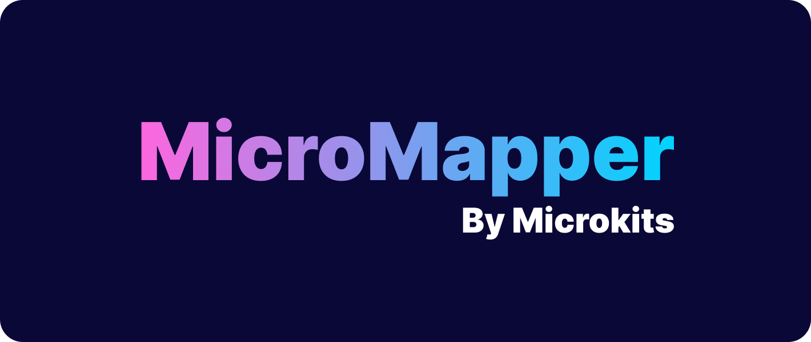

# MicroMapper



<b>MicroMapper</b> is a small and flexible library that allows you to map between different object types. It provides a simple and powerful API to perform the mapping, and it is highly configurable. This library is especially useful when working with data transfer objects (DTOs) and entities.

MicroMapper is written entirely in <b>TypeScript</b>, but supports <b>JavaScript</b> as well.

## Why use @microkits/micromapper?
* Facilitates code maintenance as it allows mapping rules to be defined in one place.
* Improves code readability as mapping rules are expressed clearly and concisely.
* Supports mapping of arrays, classes, primitive values and complex objects.
* Allows reuse of mappings anywhere in the code

## Installation

To use @microkits/micromapper in your project, you need to install it with npm or yarn.

Install with **npm**:
```sh
npm install @microkits/micromapper
```

Install with **yarn**:
```sh
yarn add @microkits/micromapper
```

## Basic usage

Here is an example of how to use the library to map between two object interfaces:

```typescript
interface Input {
  name: string;
  surname: string;
}

interface Output {
  fullName: string;
}

const mapper = new MicroMapper<Input, Output>(mapper => (
  mapper.object({
    fullName: mapper.string(input => (
      `${input.name} ${input.surname}`
    ))
  })
));

const input = {
    name: "John",
    surname: "Doe"
};

const output = mapper.map(input);
console.log(output); // output: { fullName: "John Doe" }
````
